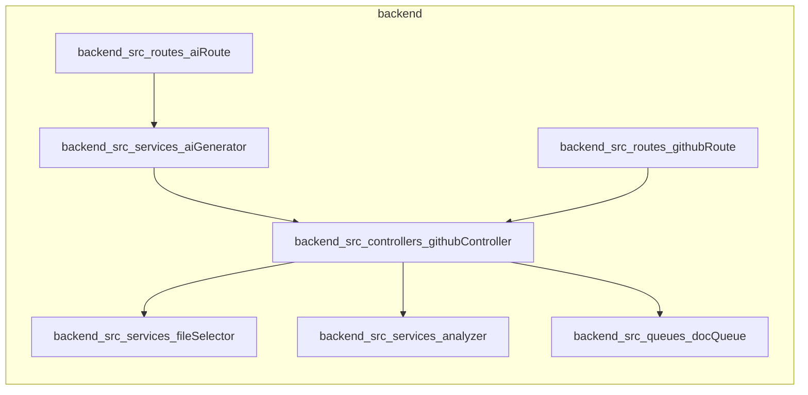

# RepoReadMe AI Generator

RepoReadMe AI Generator is an automated service designed to analyze GitHub repositories and generate comprehensive, professional `README.md` files using Google's Gemini AI. It streamlines the documentation process by automatically detecting tech stacks, repository structures, and key features.

## Features

*   **Automated Analysis:** Scans repository file trees to identify project structure and technology stacks (e.g., TypeScript, Express, Prisma).
*   **AI-Powered Writing:** Utilizes Google GenAI (Gemini) to generate context-aware documentation.
*   **Dependency Analysis:** Automatically identifies project dependencies and summarizes key libraries and modules.
*   **Automated Diagrams:** Generates Mermaid.js diagrams to visualize project structure and dependency graphs.
*   **Webhook Integration:** Automatically triggers documentation updates via GitHub webhooks.
*   **Queue Management:** Uses Redis and BullMQ to handle documentation generation tasks asynchronously with concurrent processing, ensuring high scalability and performance.
*   **Incremental Updates:** Supports both initial `README.md` generation and updates to existing files while preserving custom content.

## Tech Stack

*   **Backend:** TypeScript, Express
*   **AI/LLM:** Google GenAI (Gemini SDK)
*   **ORM:** Prisma
*   **Database:** Redis
*   **Queueing:** BullMQ
*   **GitHub Integration:** Octokit

## Architecture



## Prerequisites

*   Node.js (v20+)
*   Redis server (e.g., Upstash)
*   PostgreSQL database
*   Gemini API Key

## Installation

1.  **Clone the repository:**
    ```bash
    git clone <repository-url>
    cd backend
    ```

2.  **Install dependencies:**
    ```bash
    npm install
    ```

3.  **Environment Variables:**
    Create a `.env` file in the root directory and configure the following:
    ```env
    DATABASE_URL="your_database_connection_string"
    GEMINI_API_KEY="your_google_ai_api_key"
    REDIS_URL="redis://localhost:6379"
    REDIS_PASSWORD="your_redis_password"
    GITHUB_APP_ID="your_github_app_id"
    GITHUB_PRIVATE_KEY_PATH="/path/to/your/private-key.pem"
    ```

4.  **Database Setup:**
    ```bash
    npx prisma generate
    npx prisma migrate dev
    ```

5.  **Running the Application:**
    *   Start the API server:
        ```bash
        npm run dev
        ```
    *   Start the background worker for document generation:
        ```bash
        npm run worker
        ```

## Usage

The application exposes REST endpoints to trigger repository analysis and documentation generation:

*   **Analyze Repository:** `GET /repository?owner=<owner>&repo=<repo>`
    Triggers an analysis of the specified GitHub repository.
*   **GitHub Webhook:** `POST /postreceive`
    Endpoint configured for GitHub to send events. Processes repository changes automatically.
*   **Path Analysis:** `GET /path`
    Returns the file structure of a specific repository.

## Project Structure

```text
backend/
├── src/
│   ├── controllers/    # Request handlers for GitHub webhooks and API routes
│   ├── models/         # Prisma schemas and interface definitions
│   ├── queues/         # Bull queue configurations for background jobs
│   ├── routes/         # Express route definitions
│   ├── services/       # Core logic (AI generation, repo analysis, file selection)
│   └── worker/         # Background worker logic for processing queues
├── package.json        # Dependencies and scripts
└── prisma/             # Database schema and migrations
```

## Contributing

Contributions are welcome! Please follow these steps:

1.  Fork the repository.
2.  Create a feature branch (`git checkout -b feature/amazing-feature`).
3.  Commit your changes (`git commit -m 'Add some amazing feature'`).
4.  Push to the branch (`git push origin feature/amazing-feature`).
5.  Open a Pull Request.

## License

This project is licensed under the MIT License.