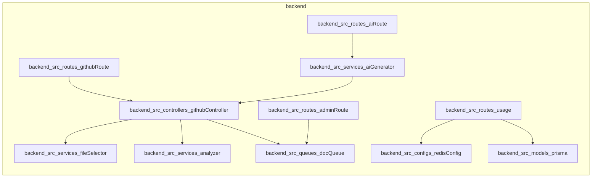

# RepoReadMe AI Generator

RepoReadMe AI Generator is an automated service designed to analyze GitHub repositories and generate comprehensive, professional `README.md` files using Google's Gemini AI. It streamlines the documentation process by automatically detecting tech stacks, repository structures, and key features to keep project documentation up-to-date.

## Features

*   **Automated Analysis:** Scans repository file trees to identify project structure and technology stacks.
*   **AI-Powered Documentation:** Utilizes Google Gemini AI to generate context-aware, professional project documentation.
*   **Asynchronous Processing:** Leverages BullMQ and Redis to handle documentation generation tasks in the background for high performance.
*   **GitHub Webhook Integration:** Automatically triggers documentation updates via GitHub webhooks whenever repository changes occur.
*   **Admin Dashboard:** Provides an interface for monitoring queue status, retrying failed jobs, and managing background tasks.
*   **Usage Tracking:** Monitors and enforces usage limits based on repository installations.

## Tech Stack

*   **Backend:** TypeScript, Express
*   **AI/LLM:** Google GenAI (Gemini SDK)
*   **ORM:** Prisma
*   **Database:** Redis
*   **Queueing:** BullMQ
*   **GitHub Integration:** Octokit

## Architecture



## Installation

### Prerequisites
*   Node.js (v20+)
*   Docker & Docker Compose
*   Redis server
*   PostgreSQL database
*   Gemini API Key

### Setup
1. **Clone the repository:**
   ```bash
   git clone <repository-url>
   cd backend
   ```

2. **Install dependencies:**
   ```bash
   npm install
   ```

3. **Environment Variables:**
   Create a `.env` file in the root directory:
   ```env
   DATABASE_URL="your_postgres_connection_string"
   GEMINI_API_KEY="your_gemini_api_key"
   REDIS_URL="redis://localhost:6379"
   GITHUB_APP_ID="your_github_app_id"
   ```

4. **Run the application:**
   ```bash
   # Start the API and the background worker
   npm run start
   ```

## API Documentation

### GitHub Integration
*   **GET `/repository?owner=<owner>&repo=<repo>`**
    Triggers an analysis and documentation generation process for the specified repository.
*   **GET `/path`**
    Returns the file structure tree of a repository.
*   **POST `/postreceive`**
    Webhook endpoint for GitHub to trigger automatic updates on repository changes.

### Admin & Queue Management
*   **GET `/admin/queue/stats`**
    Retrieves current counts for waiting, active, completed, and failed background jobs.
*   **POST `/admin/queue/retry-failed`**
    Attempts to re-process all failed jobs in the queue.
*   **GET `/admin/queue/failed`**
    Returns a detailed list of failed jobs, including error messages and attempt counts.
*   **POST `/admin/queue/clean`**
    Removes historical, completed jobs from the queue.

### Usage & AI
*   **GET `/usage/:installationId`**
    Returns current usage statistics, tier information, and remaining generation limits for an installation.
*   **GET `/ai`**
    A test endpoint to verify connectivity with the Gemini AI service.

## Project Structure

The project follows a standard Node.js architecture where Express routes handle incoming API requests, a dedicated service layer encapsulates core business logic like repository analysis and AI generation, and Prisma manages database interactions. Background tasks are decoupled from the main request-response cycle and processed asynchronously via BullMQ workers.

## Contributing

Contributions are welcome! Please follow these steps:
1. Fork the repository.
2. Create a feature branch (`git checkout -b feature/amazing-feature`).
3. Commit your changes.
4. Push to the branch.
5. Open a Pull Request.

## License

This project is licensed under the MIT License.